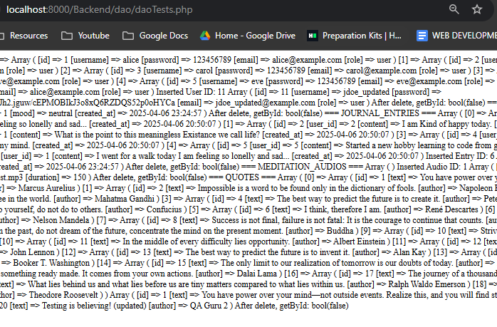

# Quipy: A Mental Health Website

## MileStone 1:

**Quipy** is a Mental Health website designed to help users manage anxiety, depression, stress, and more. It offers a range of features to promote mental well-being, including:

- **Motivational Quotes:** Inspirational messages.
- **Journaling:** A space for keeping notes and reflections.
- **Mood Tracking:** Tools to monitor your emotional state.
- **Guided Meditation:** Sessions to help you relax and focus.

---

### CSS

- `custom.css`

---

## Views

- **about.html:** Information about Quipy.
- **admin.html:** Administration panel (includes CSS styling).
- **home.html:** Main page featuring motivational quotes.
- **journaling.html:** User journaling interface.
- **meditation.html:** Meditation session page.
- **moodTracking.html:** Mood tracking interface.
- **index.html:** Entry point of the website.

---

## Database Schema (Planning Only)))

## Milestone 2: Backend DAO Implementation

In Milestone 2, I focused on implementing the backend functionality using Data Access Objects (DAO) for CRUD operations. This milestone includes the creation of a reusable **BaseDao** class and the implementation of specific DAOs for different entities in the system.

### Key Implementations

- **BaseDao**: A parent class (BaseDaov2.php) for all other DAOs, containing common database functions (such as create, read, update, delete). This class is extended by other DAOs to reduce code duplication.
- **Child DAOs**: Each DAO (JournalEntryDao.php, MeditationAudioDao.php, MoodDao.php, QuoteDao.php, UserDao.php) inherits from BaseDao, allowing for easy extension and maintenance of the database functions for each entity.

- **Database Connection**: The connection to the database is established in **config.php** and inherited by all DAO classes.

---

## Database Schema

---

## DAO Files

The **dao** directory contains the core files for handling database connections and operations.

- **BaseDaov2.php**: The parent class containing common database functions for CRUD operations.
- **daoTest.php**: A test file to verify that the DAO operations are functioning correctly.
- **config.php**: Establishes the database connection, inherited by all DAO classes.
- **quipy.sql**: SQL script to create the relational database using MySQL Workbench.
- **quipyDataForDataBase.sql**: A SQL file containing sample data for the Quipy database.
- **dataBaseQueryCode.txt**: Contains the SQL code used to create the database schema.

---

## Child DAOs of BaseDaov2.php

These are the child DAO classes that extend **BaseDaov2.php** to implement CRUD operations for different entities:

- **JournalEntryDao.php**: Handles CRUD operations for journal entries.
- **MeditationAudioDao.php**: Handles CRUD operations for meditation audio tracks.
- **MoodDao.php**: Handles CRUD operations for mood tracking.
- **QuoteDao.php**: Handles CRUD operations for motivational quotes.
- **UserDao.php**: Handles CRUD operations for user data.

---

## Expected Result from daoTest.php

The **daoTest.php** file will output the following results, confirming that the DAO operations are working as expected: (note run in terminal -> php -S localhost:8000)

---

### Summary

Milestone 2 focuses on improving the backend functionality by implementing reusable DAO classes for CRUD operations, establishing a clean and efficient structure for future extensions. The goal is to simplify database interactions and ensure easy maintainability of the backend logic.

M1
M2